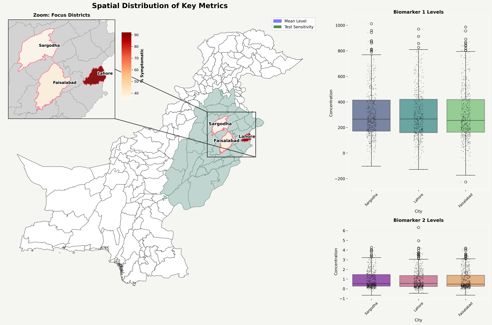

# The Map of 3 Districts - Punjab

> **Note:** This is a **dummy version** of an academic visualization project. All clinical data has been **distorted or anonymized** for demonstration purposes. No real patient information is exposed.

## Project Summary

This project demonstrates how to visualize district-level health data using spatial maps, clinical metrics, and statistical plots. It focuses on **three districts in Punjab, Pakistan**, and uses public health markers for educational illustration.

## Spatial Distribution of Key Metrics

This figure summarizes the spatial distribution of clinical indicators across 3 districts.



## Key Visual Elements

- **District Map**
  - Color-coded by % of symptomatic cases
  - Circle sizes represent average Mean levels
  - Overlay bars for Test sensitivity
- **Inset Boxplots**
  - Compare biomarkers across cities
- **Anonymized Data**
  - All values are distorted for public sharing

## Project Structure
```bash
the_map_of_3_districts_punjab/
│
├── figures/                      # Output figures and plots
├── pak_adm_wfp_20220909_shp/    # Shapefiles for district-level mapping
├── Boxplot related matrices for map/
│   ├── boxplot_data_for_inset.csv  #  biomarker stats
│   └── city_metrics_summary.csv    #  map metrics
│
├── the_map_of_3_districts_punjab.ipynb  # Main Jupyter notebook                      
└── README.md
```
## How to Use

###  1. Clone this Repo

```bash
git clone https://github.com/Muhammad-Lukman/the_map_of_3_districts_punjab.git
cd the_map_of_3_districts_punjab
```

###  2. Install Dependencies

```bash
pip install pandas seaborn matplotlib scikit-learn scipy statsmodels plotly geopandas --q
pip install folium shapely --q
 ```          
###  3. Run the Notebook

```bash
jupyter notebook the_map_of_3_districts_punjab.ipynb
```
